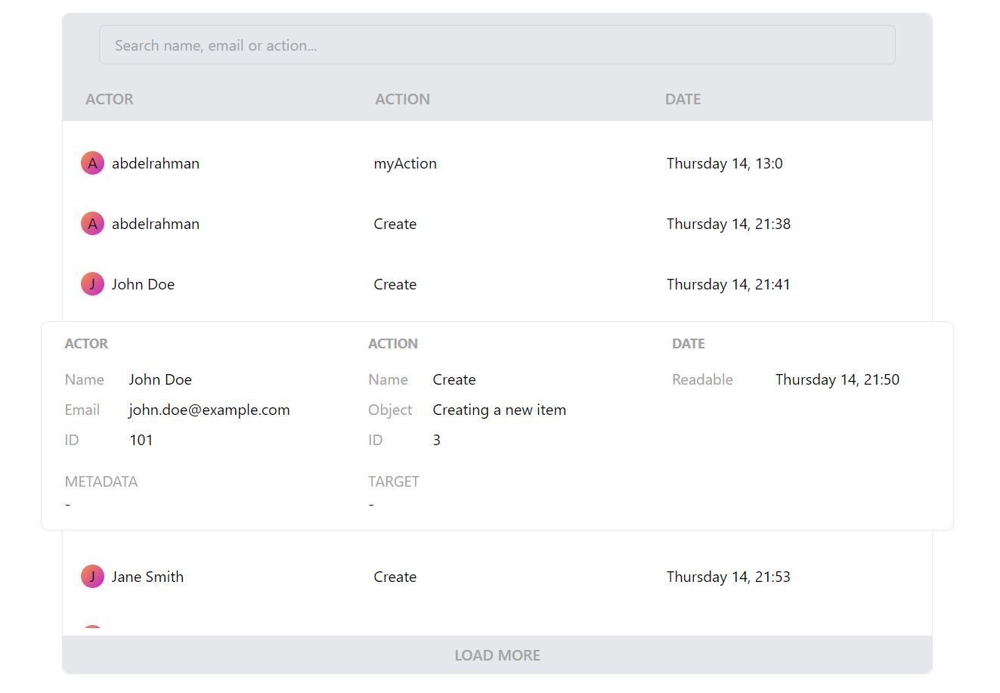

# Event Logging Project - A PERN Stack Application

## Description

This project is an event logging web application developed using the PERN (PostgreSQL, Express, React, Node.js) stack, TypeScript, and Tailwind CSS. Its main purpose is to provide a platform for users to log and track events, making it useful for various applications such as project management, issue tracking, or personal event organization.

**Problem:** Many individuals and teams need a straightforward way to log and keep track of events. This application addresses this need by offering a user-friendly interface to create, view, update, and delete events.

**What I Learned:** During the development of this project, I acquired knowledge and skills in setting up a PERN stack application, implementing TypeScript for improved code quality, and using Tailwind CSS for responsive and attractive user interfaces.

## Features

- **Create Events:** Users can easily create new events by providing event details such as title, date, description, and category.

- **View Events:** Users can view a list of all events with the ability to filter and sort them based on categories or dates.

- **Responsive Design:** The application is designed to be responsive, ensuring a seamless experience on various screen sizes.

## Demo Screenshot

## Technologies

This Event Logging Project was built using the following technologies and frameworks:

- **PERN Stack:**
  - PostgreSQL: For database management and storage of event data.
  - Express.js: As the backend framework for API development.
  - React.js: For building the frontend user interface.
  - Node.js: For server-side scripting and API integration.

- **TypeScript:** Used for enhanced code readability, type safety, and improved development experience.

- **Tailwind CSS:** Utilized for responsive and stylish UI design.

- **npm and yarn:** Package managers to handle project dependencies.